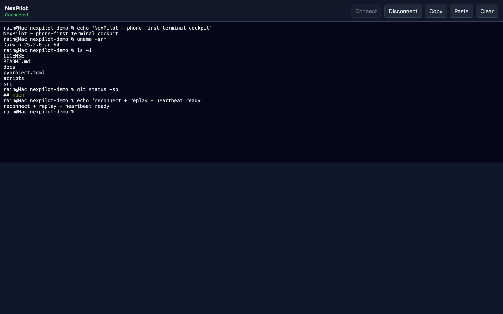
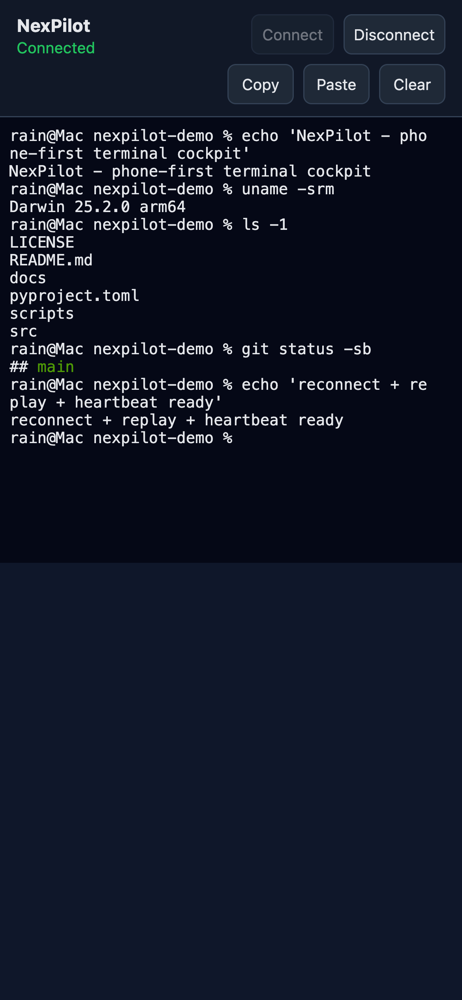

# NexPilot Public Trial

NexPilot is a phone-first terminal cockpit. Run a small agent on your computer,
open the printed URL on your phone, and control a local shell through the mobile
browser.

## Screenshots

| Desktop | Mobile |
|---|---|
|  |  |

The same cockpit adapts from a wide desktop terminal to a phone-sized viewport, with
reconnect, output replay, heartbeat, and copy/paste/clear controls built in.

This public trial is intentionally local-first:

- No Rain/M4/Kai/NexDesk backend is required.
- No production token, database, device ID, or private relay is included.
- The agent runs on the tester's own computer.
- Remote use should go through a private network such as Tailscale, not the open
  public internet.

## Status

Private beta package. macOS and Linux are supported through POSIX PTY. Windows
is supported as a private beta path through ConPTY with optional `pywinpty`.

This release includes terminal reconnect, recent output replay, heartbeat,
mobile viewport handling, input/output batching, large paste chunking, and
copy/paste/clear controls. It is closer to a Termius-style terminal baseline,
but it is not yet full Termius feature parity.

## Quick Start

```bash
git clone https://github.com/awe7893625/nexpilot-private-beta.git
cd nexpilot-private-beta
bash scripts/install.sh
bash scripts/run-lan.sh
```

Manual install:

```bash
git clone https://github.com/awe7893625/nexpilot-private-beta.git
cd nexpilot-private-beta
python3 -m venv .venv
source .venv/bin/activate
pip install -e .
nexpilot --lan
```

Open the printed URL on your phone. Keep the token private. Anyone with that URL
can control the shell while the agent is running.

Windows private beta:

```powershell
Set-ExecutionPolicy -Scope Process Bypass
.\scripts\install-windows.ps1
.\.venv\Scripts\nexpilot.exe --lan
```

## Safer First Run

For first-time testing on the same computer:

```bash
nexpilot
```

This binds to `127.0.0.1` only. For phone testing on the same Wi-Fi, run
`nexpilot --lan`.

## Security Basics

- The access token is generated at startup unless `--token` is provided.
- The token is required for terminal WebSocket access and API calls.
- The terminal runs as your current OS user. Do not run as `root`.
- Do not expose this directly to the public internet.
- Prefer Tailscale, WireGuard, or another private network for remote use.
- Stop the process to revoke access immediately.
- This private beta is non-transferable. Do not copy, mirror, upload, or
  redistribute it.

Read [docs/SECURITY_MODEL.md](docs/SECURITY_MODEL.md) before sharing this with
testers.

For a shorter tester handoff, use
[docs/TESTER_QUICKSTART.md](docs/TESTER_QUICKSTART.md).

For Windows, read [docs/WINDOWS_BETA.md](docs/WINDOWS_BETA.md).

For terminal scope, read [docs/TERMINAL_GRADE_BETA.md](docs/TERMINAL_GRADE_BETA.md).

For copy/redistribution boundaries, read
[docs/BETA_TESTER_TERMS.md](docs/BETA_TESTER_TERMS.md).

## What Is Not Included

The private M4ControlCenter, Kai task system, internal NexDesk hub, production
Cloudflare Access settings, Tailscale auth keys, public cloud relay, databases,
logs, and Rain's private device IDs are not part of this package.

## Development Checks

```bash
python3 -m compileall src tests
python3 scripts/secret-scan.py .
PYTEST_DISABLE_PLUGIN_AUTOLOAD=1 PYTHONPATH=src python3 -m pytest
```

With a local server running on `127.0.0.1:8765` and token `test-token`:

```bash
python3 scripts/smoke-terminal.py --url 'ws://127.0.0.1:8765/ws/terminal?token=test-token'
```

## Publish To GitHub

This project should be pushed as a private beta first:

```bash
bash scripts/publish-github.sh
```

The script refuses to continue if `gh` is not authenticated, reruns the
prepublish gate, creates `awe7893625/nexpilot-private-beta` as a private repo if
needed, and pushes `main`.

## License

Private beta evaluation only. See [LICENSE](LICENSE).
